<div align="center">



# testprune

### Agent Skill for test suite cleanup: delete the obsolete tests that no longer describe production, and stop waiting on the check you run after every edit

Clone it into your agent's Skills folder, open a repo, and run `/testprune`.

Works in Claude Code and Codex CLI, and in other clients that implement the [Agent Skills open standard](https://github.com/agentskills/agentskills).

[](LICENSE)
[](https://github.com/agentskills/agentskills)
[](SKILL.md)

**Language-agnostic · No paid or networked calls · Every deletion recoverable · Never changes runtime behavior**

</div>

---

> testprune is an Agent Skill that audits a repository's automated test suite, removes the obsolete tests that no longer describe production, retargets the invariants worth keeping at the production code path, and builds layered gates so a routine check finishes in seconds instead of minutes. It ends by writing a test policy into `CLAUDE.md` and `AGENTS.md` so coding agents stop reaching for the full suite. It runs once against a repository rather than continuously in CI, it never changes production runtime behavior, and every deletion is recoverable from the commit hash it records.

## ⏱️ The time it gives back

This is the reason to run it. Everything else on this page exists to make the speedup safe rather than a trick, because a fast gate is only worth having if green still means something.

In the second of two repositories, the routine check an agent runs after every edit went from 41.90 seconds to 2.72 seconds. That is a 93.5% cut in feedback latency, or 15.4 times faster.



| Edit and test cycles | Before | After | Saved |
| --- | ---: | ---: | ---: |
| One cycle | 41.90 s | 2.72 s | 39.18 s |
| Five cycles | 3m 30s | 13.6 s | 3m 16s |
| Ten cycles | 6m 59s | 27.2 s | 6m 32s |
| Twenty cycles | 13m 58s | 54.4 s | 13m 04s |

The ratio is fixed, so the saving compounds with how often you run the check, and an agent runs it constantly. A realistic session of ten fast iterations, one subsystem check, and one broad pre-push check now takes about 2 minutes 24 seconds. The same ten iterations alone used to cost about 7 minutes, before any release-level verification ran at all.

<details><summary>Per-subsystem numbers from the same repository</summary>

Ten fast iterations plus one subsystem check, measured against ten of the old routine checks:

| Work area | New total | Saved |
| --- | ---: | ---: |
| Runtime | 32.9 s | 6m 26s |
| Research | 31.8 s | 6m 27s |
| Artifacts | 35.9 s | 6m 23s |
| Studio | 47.7 s | 6m 11s |
| Responsible AI | 40.2 s | 6m 19s |
| Environment | 50.8 s | 6m 08s |

The broad gate stays at 111 seconds and is an intentional pre-push cost, not a routine one.

</details>

The first repository was a heavier case: a 24-minute suite carrying 186 stale failures became a 10-second fast gate with zero failures. Different starting points, the same shape of result.

Both are measured single cases, not benchmarks. Your suite's numbers will differ.

## 🧹 The problem

- **Slow suites get skipped.** A check nobody runs protects nothing, and the wait compounds every time you touch the code.
- **Green stops meaning anything.** A suite that certifies a deprecated or parallel implementation is worse than no suite, because passing tells you nothing about what users run.
- **Red stops meaning anything.** Once a wall of stale failures is normal, everyone learns to scroll past it, and the real regression scrolls past too.
- **Agents pay the worst price.** A coding agent re-runs the suite on every iteration, reads the same stale failures every time, and burns its context window on output that never changes.

## 📋 What a run leaves behind

Three commands, a policy your agent reads, and a ledger of every deletion.

```bash
scripts/run_test_gates.sh fast              # explicit file list, zero known failures, seconds
scripts/run_test_gates.sh subsystem api     # one owning boundary
scripts/run_test_gates.sh broad             # everything provider-free, before a push
```



Here is the policy block it wrote into `CLAUDE.md` and `AGENTS.md` in the repository this Skill was built on, so the next agent session reaches for the fast gate instead of the whole suite:

```markdown
## Test suite policy

- Production authority: main/orchestrator.py is the only production path tests may certify.
  main/orchestrator_V2.py is deprecated code retained for history: no tests, no parity tests,
  and production is never changed to match it.
- Default verification: `scripts/run_test_gates.sh fast` (10 s, zero known failures) after every
  edit; the subsystem gate for the boundary you touched; `scripts/run_test_gates.sh broad`
  (10 min, 33 classified pre-existing failures) only before a push.
- Removal standard: no skip markers, no root conftest skip machinery, no xfail-forever.
```

And here is what changed in that first repository, taken from tool output during the run. **This is one case, not a benchmark.** Your repository will differ.

| Run | Before | After |
| --- | --- | --- |
| Fast gate | 24 min (there was no fast gate) | 10 s |
| Broad gate | 24 min | 10 min |
| Failures an agent has to read | 186 | 0 in the fast gate, 33 classified in the broad gate |
| Slowest two tests | 70 s each | 4 s each |

Twenty-three deprecated and historical test files went with `git rm`, four untracked ones were archived, and three invariants were retargeted at the production orchestrator. No production code changed.

## ⚡ Install and run

Claude Code reads personal Skills from `~/.claude/skills/`, and Codex reads them from `~/.agents/skills/`. Clone into whichever your client uses:

```bash
# Claude Code
git clone https://github.com/NeuraCerebra-AI/testprune.git ~/.claude/skills/testprune

# Codex CLI
git clone https://github.com/NeuraCerebra-AI/testprune.git ~/.agents/skills/testprune
```

Then, in a session opened on the repository you want cleaned:

```
/testprune                 # audit and execute in this session, budget about two hours
/testprune prompt-first    # only write a curated, repo-specific prompt, change nothing
/testprune followups       # execute the items a prior pass deferred, budget about forty-five minutes
```

Start with `prompt-first` if you'd rather read the plan before anything is deleted. It produces a repo-specific audit prompt and a companion follow-up prompt, and it touches no test.

Requirements: a client that supports Agent Skills (Claude Code or Codex CLI, for example), `git`, `bash` 3.2 or newer for the gate script, and Python 3.7 or newer for the inventory script. The Skill itself is language-agnostic; only that one helper script needs Python.

## 🔍 How it works

The run is an audit, then a set of decisions, then a measurement. It follows a 13-step checklist in [`SKILL.md`](SKILL.md); the four steps that do the real work are these.

**First, it establishes production authority.** From entrypoints, deploy config, CI, and config resolvers it names the one path real users hit, and names every deprecated or parallel implementation by file with proof that production doesn't route through it. Everything after this hangs on that answer, which is why it happens before a single test is read.

**Then it classifies every test module into exactly one bucket:** production coverage, deprecated-path coverage, historical or stale-intent, live/paid/credentialed, environment-dependent, duplicated, or untracked ad hoc. Classification is by what a test proves, not by the vocabulary in its fixtures. A test that inserts rows in a retired format and asserts they still open is production coverage, not deprecated-path coverage, and it stays.



**Before anything is deleted, real invariants are retargeted.** A bad test can still be the only thing pinning a real guarantee. Those get one focused test each against the production path first, in the repo's own offline harness and its neighbors' style, and only then does the original go.

**Removal is recoverable, never hidden.** Tracked files go with `git rm` and the recovery commit hash lands in the ledger. Untracked files move to a gitignored archive, because deleting an untracked file can't be undone. No skip markers, no root conftest skip machinery, no xfail-forever, because those preserve the scrolling instead of ending it.

It also runs [`scripts/test_inventory.py`](scripts/test_inventory.py) early, which exists for one reason: git ignore rules control commits, not collection. In the repository this Skill was built from, 74 gitignored test modules still ran in every broad run and were invisible to anyone reading `git ls-files`.

## 🚧 What it won't do

The boundaries are rules in `SKILL.md`, copied verbatim into any prompt the Skill writes.

- **No runtime changes.** It never changes application logic to make a test pass, and it never deletes the deprecated implementation itself. In `followups` mode a comment-only edit to a production file is possible when a stale comment is the thing that's wrong, and the report says so explicitly. Anything that would change behavior is parked as a product decision instead.
- **No paid calls.** No test that claims to be offline may reach a paid, networked, or credentialed service, and the run proves zero calls afterwards rather than assuming them.
- **No destructive git.** It never runs `git restore`, `git checkout --`, `git reset --hard`, or `git stash`, and it doesn't commit unless you ask.
- **No touching other people's work.** Files already dirty from other work in progress get reported, not edited.
- **No invented numbers.** Every figure in the closing report comes from tool output, measured before and after.

## ⚖️ How it compares

Different tools, different jobs, and testprune loses two of these six rows on purpose. If your suite is already fast and honest and you just want fewer tests executed per commit, one of the tools below fits better.

| | testprune | Predictive test selection<br>(Launchable, Nx affected, pytest-testmon, testtrim) | Flaky-test platforms<br>(Trunk.io, BuildPulse, Datadog) | Mutation testing<br>(Stryker, mutmut, PIT) |
| --- | --- | --- | --- | --- |
| **When it runs** | Once, as an audit | Every commit, indefinitely | Continuously across CI history | On demand, often slowly |
| **What it changes** | What the suite contains | Which tests execute | Which tests are quarantined | Nothing, it reports |
| **Decides a test shouldn't exist** | Yes | No | No | Suggests, doesn't decide |
| **Needs CI integration or run history** | No | Yes | Yes, weeks of runs | No |
| **Speeds up a suite that's already clean** | No | Yes | No | No |
| **Measures test strength formally** | No, classification is a judgment call | Not its job | No | Yes, by mutation kill rate |

In plain terms: it isn't test impact analysis or predictive test selection, it isn't a flaky-test detector or quarantine system, it isn't a coverage or mutation-testing tool, and it isn't an implementation of formal test-suite minimization research.

## 📊 Why this matters

Slow and untrustworthy suites are measured, not anecdotal. CircleCI's analysis of 14,146,319 workflows found a median duration of 2 minutes 43 seconds but workflows running more than 25 minutes at the 95th percentile, against its own recommended 10-minute benchmark ([CircleCI, 2025 State of Software Delivery](https://circleci.com/landing-pages/assets/2025-state-of-software-delivery-report.pdf)). Google reported that of roughly 4.2 million tests on its CI system, about 63,000 had a flaky run over one week, with 14% of its large tests flaky ([Google Testing Blog, 2017](https://testing.googleblog.com/2017/04/where-do-our-flaky-tests-come-from.html)), and that about 84% of observed pass-to-fail transitions involved a flaky test rather than a real regression ([Google Testing Blog, 2016](https://testing.googleblog.com/2016/05/flaky-tests-at-google-and-how-we.html)).

Lost trust is the expensive part, because a suite nobody believes still costs the full runtime. In a survey of 335 developers, 51% reported hitting test flakiness at least weekly, and they ranked lost trust in test results and wasted developer time as more severe consequences than the wasted compute ([Gruber and Fraser, IEEE ICST 2022](https://arxiv.org/abs/2203.00483)).

### Related research, and what it does not say

Telling an agent to run tests isn't the same as telling it which tests mean something, and one study found the generic instruction measured worse than no instruction at all. TDAD, evaluated on SWE-bench Verified, measured a 6.08% baseline regression rate for a coding agent given no special testing instructions. Adding procedural instructions to follow test-driven practices raised regressions to 9.94%, while giving the agent a map of which tests actually covered the change dropped them to 1.82% ([Alonso, Yovine and Braberman, arXiv, March 2026](https://arxiv.org/abs/2603.17973)).

Two caveats, stated plainly because they matter. That paper evaluates a dependency-graph tool that sits in the predictive-test-selection category, which is a different category from this one, so none of those numbers are a result for testprune. And testprune has never been evaluated on SWE-bench or measured for its effect on agent regression rate at all. The only measured result on this page is the single-repository before-and-after above.

## ❓ FAQ

**How do I make my test suite fast enough for a coding agent to run it on every change?**
Make the routine check a short, explicit list of files with zero known failures, and write that command into `CLAUDE.md` or `AGENTS.md` as the default. testprune builds that list, measures it, and writes the policy. The fast gate is an explicit file list rather than a glob or a marker, because a glob drifts and can wander into an ignored, live, or environment-dependent test.

**Is it safe to let an AI delete my tests?**
Deletions are recoverable and the run is auditable, which is the honest version of "safe". Tracked tests go with `git rm` and the ledger records the commit hash you restore from. Untracked tests move to a gitignored archive rather than being deleted, because that operation isn't reversible. In Claude Code it is user-invoked only (`disable-model-invocation: true` in `SKILL.md`), so Claude can't start it on its own. To read the plan before anything moves, run `/testprune prompt-first`, which changes nothing.

**How do I know which tests are safe to delete?**
A test becomes a deletion candidate when it exercises an implementation that production doesn't route through, or when it pins wording, numbering, pricing, or model names that the source is expected to keep changing. Both require naming the production path first, with file-level proof. A test that is merely failing is not a candidate: a permanently red test whose expectation can't be corrected with source authority is left red and listed rather than quietly removed.

**Does it work with Jest, Vitest, Go, or Rust, or only pytest?**
testprune is language-agnostic in design. The gate script template takes any runner (`npx jest --`, `go test`, `cargo test --`, `python -m pytest`), and the inventory script recognizes pytest, Jest, Vitest, Go, Rust, and Ruby naming conventions out of the box. The examples throughout the reference files are Python and pytest because that's the stack it was built on, so on other stacks expect to adapt commands rather than concepts.

**How is this different from Launchable or pytest-testmon?**
Those tools decide which of your existing tests to run for a given commit, every commit, forever. testprune decides which tests should exist at all, once. A selection tool treats a deprecated-path test as an equally legitimate candidate to run; it has no opinion about whether that test deserves to be in the repository. The two are complementary, and a selection tool works better on a suite that's already been cleaned.

**How do I stop Claude Code from running the entire test suite on every small change?**
Give Claude Code a faster default and say so in the file it reads first. Agents read `CLAUDE.md` or `AGENTS.md` before anything else, so a 10-second gate saves nobody time until that file points at it. The policy block puts the gate commands at the top of the commands list and states plainly that the raw full-suite command is not a routine check.

**Does it work with Codex, or only Claude Code?**
Both. It is an Agent Skill, an open format originally developed by Anthropic and since adopted by other agent clients, so the same `SKILL.md` folder works unchanged in either. Claude Code loads personal Skills from `~/.claude/skills/`, Codex from `~/.agents/skills/`, and both derive the `/testprune` command from the folder name. The one Claude Code specific detail is the `disable-model-invocation: true` line in the frontmatter, which other clients ignore.

**What if I disagree with one of its decisions?**
Every deletion is listed in the ledger with its recovery hash, and every corrected expectation is listed with the source authority that justified it. Restoring one file is `git show <hash>:path/to/test.py > path/to/test.py`. Items where the evidence wasn't conclusive are written as `Confirm needed` with the competing authorities quoted, and neither side is changed.

## 📁 What's in the repository

| Path | Purpose |
| --- | --- |
| [`SKILL.md`](SKILL.md) | The rules, the 13-step checklist, the execution model, and the safety rules |
| [`references/rationale_and_pitfalls.md`](references/rationale_and_pitfalls.md) | Why each rule exists, and the failure mode behind it |
| [`references/techniques.md`](references/techniques.md) | Sleep spy, measurement, zero-call proof, archive move, allowlist edits, hunk-only staging |
| [`references/gate_script_template.sh`](references/gate_script_template.sh) | The fast, subsystem, broad, and archive gate script, bash 3.2 compatible |
| [`references/agent_instruction_block.md`](references/agent_instruction_block.md) | The `CLAUDE.md` and `AGENTS.md` policy block, in JSON and Markdown forms |
| [`references/final_report.md`](references/final_report.md) | The closing report format and both visualization templates |
| [`references/prompt_creator.md`](references/prompt_creator.md) | Prompt-first mode: writes a curated, repo-specific prompt |
| [`references/followups_execution.md`](references/followups_execution.md) | Followups mode: adjudicating production authority before any test moves |
| [`scripts/test_inventory.py`](scripts/test_inventory.py) | On-disk versus tracked versus gitignored test modules, any language |

## 📜 Where it came from

It was built from a real cleanup and then hardened by a second one, both on private repositories. The second pass added `followups` mode, which closed five deferred findings: a comment, code, and test that disagreed about provider fallback; a backend that configuration admitted but every workflow refused; a dead transport still wired into a route; legacy-row tests mistaken for deprecated coverage; and a release verifier that had to be repointed. That pass produced one comment-only production edit, four new tests, and zero runtime changes.

Every rule in `SKILL.md` traces back to something that went wrong in one of those two repositories. The reasoning is written down in [`references/rationale_and_pitfalls.md`](references/rationale_and_pitfalls.md), so you can disagree with a rule on the merits rather than guessing at its intent.

## 🤝 Contributing and license

Issues and pull requests are welcome, particularly reports from stacks other than Python and JavaScript, since that's where the reference examples are thinnest. If a rule fails you in a real repository, the most useful thing you can open is the case that broke it.

Released under the [MIT License](LICENSE).

If it saves you a suite run, a star helps other people find it.
